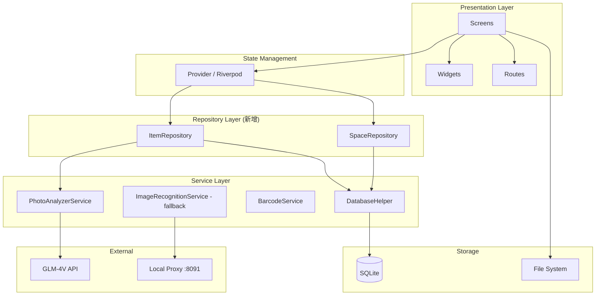

# HomeStash 架构审查报告

> 审查日期：2026-07-21
> 审查范围：docs/ (PRD, ARCHITECTURE, API_SPEC) vs 实际代码

---

## 1. 文档完整性评估

| 文档 | 状态 | 评分 | 说明 |
|:---|:---:|:---:|:---|
| PRD.md | ⚠️ 偏旧 | 6/10 | MVP 功能状态已更新但验收标准未同步；缺少已实现功能 |
| ARCHITECTURE.md | ❌ 显著落后 | 4/10 | 技术栈不完整，架构图缺模块，安全描述与实现矛盾 |
| API_SPEC.md | ⚠️ 偏旧 | 5/10 | 缺少新增接口定义，错误处理过于简单 |

---

## 2. 文档与代码差异分析 (Gap Analysis)

### 2.1 PRD.md 差异

| 差异项 | 文档描述 | 代码实际 | 严重度 |
|:---|:---|:---|:---:|
| 条形码扫描 | v1.1 规划 ⏳ | 已完整实现 (`barcode_scanner_screen.dart`) | 低 |
| AI 照片识别 | 未提及 | 已实现双重方案 (GLM-4V + 本地代理) | 中 |
| Shimmer 加载 | 未提及 | 已实现 (`shimmer_loading.dart`) | 低 |
| Splash 页面 | 未提及 | 已实现 (`splash_screen.dart`) | 低 |
| 验收标准 | 全部 [ ] | 核心功能均已实现 | 中 |

### 2.2 ARCHITECTURE.md 差异

| 差异项 | 文档描述 | 代码实际 | 严重度 |
|:---|:---|:---|:---:|
| 状态管理 | setState + FutureBuilder | 实际使用 IndexedStack + NavigationBar | 低 |
| http 依赖 | 未列出 | 已引入 (AI 识别) | 中 |
| mobile_scanner | 未列出 | 已引入 (条形码) | 中 |
| intl / path_provider | 未列出 | 已引入 | 低 |
| PhotoAnalyzerService | 架构图无此层 | 已实现 (GLM-4V 视觉识别) | 高 |
| ImageRecognitionService | 架构图无此层 | 已实现 (本地代理方案) | 高 |
| BarcodeScannerScreen | 架构图无此模块 | 已实现 | 中 |
| 网络权限 | "无需网络权限" | AI 识别需要网络 (GLM API) | **严重** |
| API Key 管理 | 未提及 | 从 ~/.hermes/.env 读取 GLM_API_KEY | 高 |
| ShimmerLoading | 未提及 | 已实现 | 低 |

### 2.3 API_SPEC.md 差异

| 差异项 | 严重度 |
|:---|:---:|
| 缺少 `getSpace(int id)` 方法 | 低 |
| 缺少 `getAllSpaces()` 方法 | 低 |
| 缺少 `getSpaceCount()` 方法 | 低 |
| 缺少 PhotoAnalyzerService 接口定义 | 高 |
| 缺少 ImageRecognitionService 接口定义 | 中 |
| 缺少条形码扫描数据流描述 | 中 |
| 错误处理未涵盖网络错误/超时 | 中 |

---

## 3. 技术债务清单

### 🔴 严重 (需立即处理)

| ID | 债务项 | 位置 | 影响 | 建议 |
|:---|:---|:---|:---|:---|
| TD-01 | **安全声明与实际矛盾** | ARCHITECTURE.md / PhotoAnalyzerService | 文档声称"无需网络权限"，但 GLM API 需上传图片到云端 | 更新安全设计章节，增加隐私说明和数据传输策略 |
| TD-02 | **重复的图像识别实现** | PhotoAnalyzerService + ImageRecognitionService | 两套方案并存，功能重叠，增加维护成本 | 统一为一种方案，或将本地代理作为离线 fallback，在架构中明确策略 |

### 🟡 中等 (应在本迭代处理)

| ID | 债务项 | 位置 | 影响 | 建议 |
|:---|:---|:---|:---|:---|
| TD-03 | **API Key 路径硬编码** | `photo_analyzer_service.dart:15` | ~/.hermes/.env 路径耦合到用户环境 | 使用 flutter_dotenv 或环境变量注入 |
| TD-04 | **GLM API 配置硬编码** | `photo_analyzer_service.dart:7-8` | URL 和模型名不可配置 | 提取到配置文件 |
| TD-05 | **本地代理端口硬编码** | `image_recognition_service.dart:7` | `127.0.0.1:8091` 不可更改 | 提取到配置 |
| TD-06 | **无状态管理库** | 全局 | setState 导致 UI 层与业务逻辑耦合，测试困难 | 引入 Provider 或 Riverpod |
| TD-07 | **Item.location 与 space_id 冗余** | `item.dart` + `database_helper.dart` | `location` 字段和 `space_id` FK 可能存在不一致 | 明确两者关系：location 是自由文本还是空间路径？ |
| TD-08 | **pubspec.yaml http 依赖重复** | `pubspec.yaml:18` `pubspec.yaml:27` | 同一依赖声明两次 | 删除重复行 |

### 🟢 低 (可延后处理)

| ID | 债务项 | 位置 | 影响 | 建议 |
|:---|:---|:---|:---|:---|
| TD-09 | **测试覆盖极低** | `test/widget_test.dart` | 仅 1 个冒烟测试 | 增加 model/db-helper 单元测试 |
| TD-10 | **数据库 migration 健壮性不足** | `database_helper.dart:75-77` | ALTER TABLE 失败被静默忽略 | 使用有意义的错误处理和版本管理 |
| TD-11 | **图片分析无本地缓存** | PhotoAnalyzerService / ImageRecognitionService | 重复拍照重复 API 调用 | 增加 LRU 缓存或结果持久化 |
| TD-12 | **无 CI/CD 配置** | 项目根 | 无法自动化构建和测试 | 添加 GitHub Actions 或类似 CI |

---

## 4. 架构改进建议

### 4.1 立即行动（更新文档）

```
1. ARCHITECTURE.md — 添加完整技术栈、AI 服务层、网络安全声明
2. PRD.md — 同步验收标准，将已实现功能从 v1.1 移至 MVP
3. API_SPEC.md — 补充新增接口、外部 API 调用规范
```

### 4.2 短期改进（1-2 周）

```
4. 统一图像识别方案：选择 GLM-4V 为主，本地代理为可选 offline fallback
5. 引入 flutter_dotenv 管理 API Key，移除硬编码
6. 引入 Provider 状态管理，解耦 UI 与数据层
7. 消除 Item.location 与 space_id 的语义冗余
8. 修复 pubspec.yaml 重复依赖
```

### 4.3 中期规划

```
9. 建立 repository 层，封装数据访问
10. 增加单元测试（至少覆盖 model 和 db_helper）
11. 添加 CI (GitHub Actions: flutter analyze + flutter test)
12. 数据库 migration 添加版本号注释和回滚策略
```

---

## 5. 推荐的目标架构



---

## 6. 总结

项目代码实现进度超前于文档，v1.1 的部分功能（条形码扫描、AI 识别）已提前完成。
当前的核心问题是：

1. **文档滞后**：ARCHITECTURE.md 与代码差距最大，安全声明存在事实性错误
2. **架构腐蚀**：两个平行的图像识别服务、硬编码配置、缺少状态管理层
3. **技术债务可控**：12 项债务中 2 项严重、6 项中等、4 项低，无阻塞性缺陷

建议优先更新 ARCHITECTURE.md 的安全设计和依赖列表，然后逐步清理技术债务。
